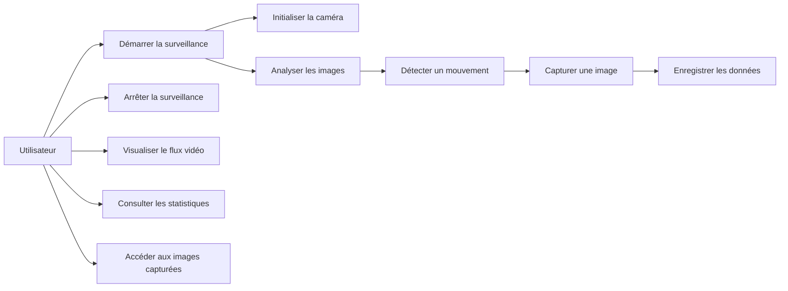
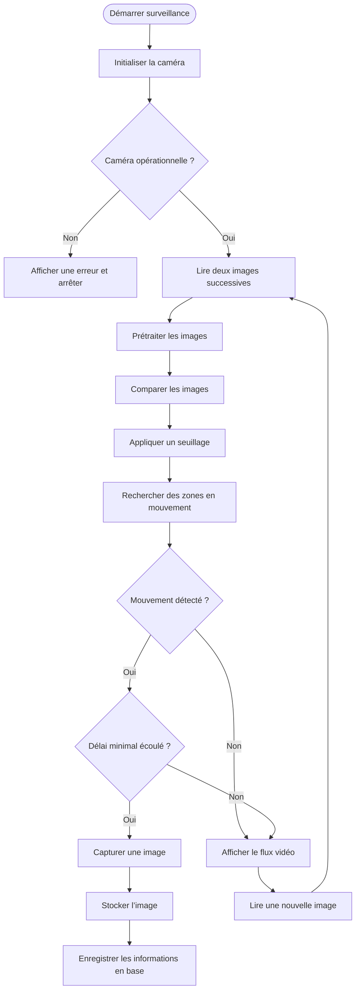
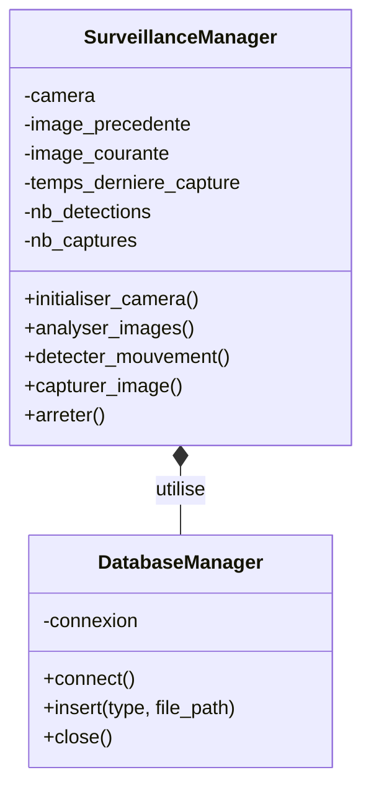

# DIAGRAMME DE CAS D’UTILISATION (SYSML)

```mermaid
flowchart LR
    U[Utilisateur]

    U --> UC1[Démarrer la surveillance]
    U --> UC2[Arrêter la surveillance]
    U --> UC3[Visualiser le flux vidéo]
    U --> UC4[Consulter les statistiques]
    U --> UC5[Accéder aux images capturées]

    UC1 --> UC6[Initialiser la caméra]
    UC1 --> UC7[Analyser les images]
    UC7 --> UC8[Détecter un mouvement]
    UC8 --> UC9[Capturer une image]
    UC9 --> UC10[Enregistrer les données]

```

# DIAGRAMME D’ACTIVITÉ (SYSML)

```mermaid
flowchart TD
    A([Démarrer surveillance]) --> B[Initialiser la caméra]
    B --> C{Caméra opérationnelle ?}

    C -- Non --> Z[Afficher une erreur et arrêter]
    C -- Oui --> D[Lire deux images successives]

    D --> E[Prétraiter les images]
    E --> F[Comparer les images]
    F --> G[Appliquer un seuillage]
    G --> H[Rechercher des zones en mouvement]

    H --> I{Mouvement détecté ?}
    I -- Non --> J[Afficher le flux vidéo]
    I -- Oui --> K{Délai minimal écoulé ?}

    K -- Non --> J
    K -- Oui --> L[Capturer une image]
    L --> M[Stocker l’image]
    M --> N[Enregistrer les informations en base]

    J --> O[Lire une nouvelle image]
    O --> D
```

# DIAGRAMME UML DE CLASSES (POO)

```mermaid
classDiagram
    class DatabaseManager {
        -connexion
        +connect()
        +insert(type, file_path)
        +close()
    }

    class SurveillanceManager {
        -camera
        -image_precedente
        -image_courante
        -temps_derniere_capture
        -nb_detections
        -nb_captures
        +initialiser_camera()
        +analyser_images()
        +detecter_mouvement()
        +capturer_image()
        +arreter()
    }

    SurveillanceManager *-- DatabaseManager : utilise
```

