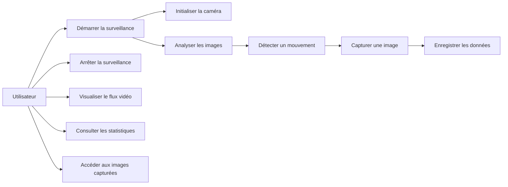
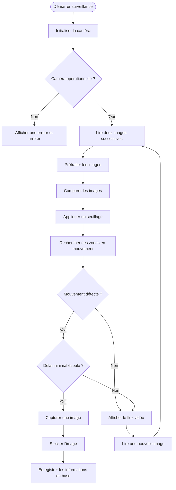
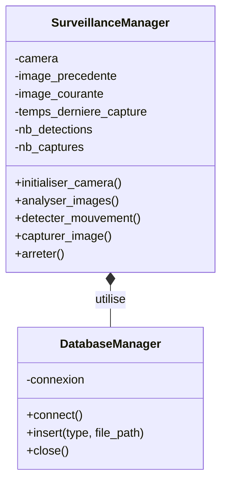

# **Dossier de mini-projet – Conforme aux consignes**

---

## **Page de garde**

* **Titre du projet :** Vidéo surveillance
* **Nom(s) de(s) étudiant(s) :** L.D. A.G
* **Classe :** CIEL2
* **Année scolaire :** 2025-2026
* **Enseignant référent :** M. Boudjelaba

---

# **1. Notice d'utilisation**

## **1.1. Objectif du produit ou de l'application**

Système de vidéosurveillance temps réel pour PC portable intégré dans une architecture de surveillance distribuée. Le système capture automatiquement des images lors de détections de mouvement et synchronise les données avec un serveur Raspberry Pi 5 centralisé.

**Contexte :** Mini-Projet 1 - Tâche 1 (Vidéosurveillance)

**Fonctionnalités principales :**
- Analyse du flux vidéo par différence de frames
- Détection de mouvement par seuillage et contours
- Capture automatique avec horodatage
- Stockage sur dossier partagé SMB
- Enregistrement des métadonnées en base MySQL distante
- Interface de monitoring Streamlit

## **1.2. Prérequis**

**Matériel nécessaire :**
- MacBook Pro avec webcam intégrée ou iPhone (Continuity Camera)
- Raspberry Pi 5 (4 Go RAM, 32 Go stockage)
- Connexion réseau entre Mac et Raspberry Pi (192.168.4.1)

**Logiciels nécessaires :**
- Python 3.13.5
- macOS (backend AVFoundation pour OpenCV)
- MySQL sur Raspberry Pi

**Librairies Python :**
- streamlit : Framework web pour interface de monitoring (simple à mettre en place, rechargement à chaud, widgets natifs)
- opencv-python : Vision par ordinateur (open source, support macOS natif, documentation exhaustive avec tutoriels)
- numpy : Manipulation des matrices d'images (opérations vectorisées 100x plus rapides que Python natif)
- mysql-connector-python : Connexion MySQL officielle (implémentation pure Python, requêtes paramétrées)

**Configurations particulières :**
- Dossier partagé monté : `/Volumes/recordings`
- Authentification : Utilisateur `axel` / Mot de passe `fi27^#COi5mlK##ZB3T4`
- Base MySQL : `192.168.4.1:3306` / Base `presence` / User `presence`

## **1.3. Procédure d'utilisation**

### **Étape 1 : Montage du dossier partagé**

**Via Finder :**
1. Ouvrir Finder
2. Menu Aller > Se connecter au serveur (Cmd+K)
3. Saisir : `smb://192.168.4.1/recordings`
4. Utilisateur : `axel`
5. Mot de passe : `fi27^#COi5mlK##ZB3T4`
6. Le dossier apparaît dans `/Volumes/recordings`

**Via terminal :**
```bash
mkdir -p /Volumes/recordings
mount -t smbfs //axel:fi27^#COi5mlK##ZB3T4@192.168.4.1/recordings /Volumes/recordings
```

**Vérification :**
```bash
ls -la /Volumes/recordings
touch /Volumes/recordings/test.txt && rm /Volumes/recordings/test.txt
```

### **Étape 2 : Préparation de l'environnement**

```bash
cd /Users/axel/Desktop/surveillance_camera/
python3 -m venv venv
source venv/bin/activate
pip install streamlit opencv-python numpy mysql-connector-python
```

### **Étape 3 : Test de connexion base de données**

```bash
mysql -h 192.168.4.1 -u presence -p
# Mot de passe : *9RSSFr5bD0WO64qurDY
```

```sql
USE presence;
SELECT * FROM enregistrement ORDER BY id_log DESC LIMIT 5;
```

### **Étape 4 : Démarrage du système**

```bash
cd /Users/axel/Desktop/surveillance_camera/
source venv/bin/activate
streamlit run code.py
```

L'interface s'ouvre automatiquement dans le navigateur à l'adresse `http://localhost:8501`

### **Étape 5 : Utilisation de l'interface**

**Barre latérale :**
- Cliquer sur "Démarrer" pour initialiser la caméra et lancer la surveillance
- Les statistiques s'affichent en temps réel (Détections, Captures, Durée)
- Cliquer sur "Arrêter" pour stopper la surveillance
- Cliquer sur "Ouvrir dossier" pour accéder aux captures

**Zone principale :**
- Flux vidéo en direct avec rectangles verts sur zones en mouvement
- Badge vert "En cours" ou gris "Inactif" selon l'état

### **Étape 6 : Arrêt du système**

**Via interface :**
- Clic sur "Arrêter" dans la sidebar

**Via terminal :**
- `Ctrl+C` dans le terminal

**Désactivation environnement :**
```bash
deactivate
```

## **1.4. Conseils et remarques**

**Limites connues :**
- Le stockage Raspberry Pi est limité à 32 Go
- Le délai minimal entre captures est de 5 secondes
- La détection nécessite un éclairage stable

**Précautions d'utilisation :**
- Vérifier que le dossier partagé est monté avant le démarrage
- Vérifier la connexion réseau vers 192.168.4.1
- Ne pas modifier les paramètres de détection sans comprendre leur impact

**Recommandations :**
- Surveiller l'espace disque disponible sur le Raspberry Pi
- Nettoyer régulièrement les anciennes captures
- Maintenir l'environnement virtuel à jour

**Configuration DEBUG :**
- `DEBUG = True` : Active les logs de connexion DB, sauvegardes, résolution caméra
- `DEBUG_MOTION = False` : Logs verbeux de détection (désactivé par défaut)
- Les messages apparaissent dans le terminal exécutant Streamlit

---

# **2. Fiche(s) de recette**

## **Fiche recette n°1**

* **Titre du test :** Test de détection de mouvement
* **Objectif du test :** Vérifier que le système détecte correctement les mouvements et capture les images
* **Préconditions :** 
  - Caméra initialisée
  - Dossier partagé monté
  - Connexion MySQL active

### **Étapes du test**

1. Lancer le système avec "Démarrer"
2. Passer la main devant la caméra
3. Observer le rectangle vert autour de la zone en mouvement
4. Attendre 5 secondes
5. Vérifier la présence de l'image dans `/Volumes/recordings`
6. Vérifier l'enregistrement dans la base MySQL

* **Résultat attendu :** Image capturée avec nom `mouvement_YYYYMMDD-HHMMSS.jpg` et enregistrement en base avec type "mouvement"
* **Résultat obtenu :** ………………………………………
* **Validation :** OK / KO

## **Fiche recette n°2**

* **Titre du test :** Test du délai anti-rafale
* **Objectif du test :** Vérifier que le système respecte le délai minimal de 5 secondes entre captures
* **Préconditions :** 
  - Système en cours d'exécution
  - Au moins une capture déjà effectuée

### **Étapes du test**

1. Effectuer un mouvement pour déclencher une première capture
2. Immédiatement après, effectuer un second mouvement
3. Observer les statistiques : "Détections" augmente mais pas "Captures"
4. Attendre 5 secondes
5. Effectuer un troisième mouvement
6. Vérifier que "Captures" augmente

* **Résultat attendu :** Pas de sauvegarde pendant les 5 secondes suivant la première capture
* **Résultat obtenu :** ………………………………………
* **Validation :** OK / KO

## **Fiche recette n°3**

* **Titre du test :** Test de connexion base de données
* **Objectif du test :** Vérifier l'enregistrement correct des métadonnées dans MySQL
* **Préconditions :** 
  - Serveur MySQL accessible sur 192.168.4.1
  - Base `presence` créée avec table `enregistrement`

### **Étapes du test**

1. Déclencher une capture
2. Se connecter à la base MySQL
3. Exécuter : `SELECT * FROM enregistrement ORDER BY id_log DESC LIMIT 1;`
4. Vérifier que le `file_path` correspond à l'image capturée
5. Vérifier que le `type` est "mouvement"
6. Vérifier que le `timestamp` correspond à l'heure de capture

* **Résultat attendu :** Enregistrement présent avec toutes les informations correctes
* **Résultat obtenu :** ………………………………………
* **Validation :** OK / KO

## **Fiche recette n°4**

* **Titre du test :** Test de sensibilité des paramètres
* **Objectif du test :** Vérifier que les paramètres THRESHOLD_VALUE et MIN_AREA filtrent correctement les faux positifs
* **Préconditions :** 
  - Système démarré dans un environnement stable

### **Étapes du test**

1. Observer le flux sans mouvement pendant 1 minute
2. Vérifier qu'aucune détection ne se produit
3. Déplacer un petit objet (< 15 cm)
4. Vérifier qu'aucune détection ne se produit
5. Passer devant la caméra
6. Vérifier qu'une détection se produit

* **Résultat attendu :** Aucun faux positif, détection correcte des mouvements humains
* **Résultat obtenu :** ………………………………………
* **Validation :** OK / KO

---

# **3. Rapport du projet**

## **3.1. Introduction**

Dans le cadre du projet de vidéosurveillance (Mini-Projet 1 - Tâche 1), l'objectif est de développer un système complet de surveillance basé sur la détection de mouvement. Ce système s'inscrit dans une architecture distribuée où un PC portable équipé d'une webcam assure la détection et la capture, tandis qu'un serveur Raspberry Pi 5 centralise le stockage et la gestion des données.

La problématique principale consiste à concevoir un système capable de détecter automatiquement les mouvements, de capturer les images pertinentes, et de synchroniser les données avec un serveur distant tout en minimisant les faux positifs et en optimisant l'utilisation du stockage.

## **3.2. Cahier des charges / Expression du besoin**

**Besoin principal :**
Mettre en place un système de vidéosurveillance automatisé pour détecter et enregistrer les événements de mouvement dans une zone surveillée.

**Fonctions attendues :**
- Installation et configuration de la caméra (logiciel)
- Développement Python du programme de surveillance
- Détection automatique de mouvement par analyse d'images
- Capture automatique avec horodatage
- Sauvegarde des données dans un dossier partagé
- Enregistrement des métadonnées dans une base de données MySQL
- Interface de monitoring en temps réel
- Documentation logicielle complète

**Contraintes techniques :**
- Langage : Python 3.13.5
- Système d'exploitation : macOS
- Backend vidéo : AVFoundation (spécifique Mac)
- Serveur : Raspberry Pi 5 (4 Go RAM, 32 Go stockage)
- Base de données : MySQL sur Raspberry Pi (192.168.4.1)
- Stockage : Dossier partagé SMB avec authentification
- Format images : JPEG avec nom horodaté

**Contraintes matérielles :**
- MacBook Pro avec webcam intégrée (Index 1) ou iPhone via Continuity Camera (Index 0)
- Connexion réseau stable entre Mac et Raspberry Pi
- Espace disque suffisant pour le stockage des captures

## **3.3. Analyse & Conception**

### **a) Diagramme de cas d'utilisation (SysML)**



### **b) Diagramme de séquence (SysML)**

**Type :** Diagramme de séquence - Détection et capture


### **c) Diagramme de Classe**



### **d) Diagramme de Gantt**

*(À insérer : planning montrant les phases du projet : Installation environnement, Développement détection, Intégration base de données, Tests, Documentation)*

### **d) Planning des séances**

| Séance | Travail réalisé |
| ------ | --------------- |
| 1      | Installation de l'environnement Python, configuration du dossier partagé, tests de connexion MySQL |
| 2      | Développement de la classe DatabaseManager, création de la table enregistrement, tests d'insertion |
| 3      | Développement de la classe SurveillanceManager, implémentation de l'acquisition caméra |
| 4      | Implémentation de l'algorithme de détection de mouvement (preprocessing, détection, filtrage) |
| 5      | Optimisation des paramètres de sensibilité (THRESHOLD_VALUE, MIN_AREA, BLUR_KERNEL) |
| 6      | Développement de l'interface Streamlit, intégration des statistiques temps réel |
| 7      | Tests unitaires et tests d'intégration, validation des fiches de recette |
| 8      | Rédaction de la documentation, finalisation du rapport |

### **e) Fiche de suivi du projet**

| Tâche | Responsable | Avancement | Difficultés |
| ----- | ----------- | ---------- | ----------- |
| Installation caméra | L.D. | 100% | Choix de l'index caméra (iPhone vs webcam interne) |
| Développement Python | A.G. | 100% | Optimisation des paramètres de détection pour réduire les faux positifs |
| Base de données | L.D. | 100% | Gestion de la reconnexion MySQL en cas de perte réseau |
| Documentation | L.D., A.G. | 100% | - |
| Tests | L.D., A.G. | En cours | - |

## **3.4. Réalisation**

### **a) Description du travail effectué**

Le projet a été réalisé en plusieurs étapes successives :

**1. Configuration de l'environnement :**
- Installation de Python 3.13.5 et création d'un environnement virtuel
- Montage du dossier partagé SMB vers le Raspberry Pi avec authentification
- Installation des librairies : streamlit, opencv-python, numpy, mysql-connector-python

**2. Développement de la base de données :**
- Création de la table `enregistrement` sur MySQL du Raspberry Pi
- Structure : id_log, timestamp, type, file_path
- Moteur InnoDB avec charset utf8mb4 pour la fiabilité transactionnelle

**3. Développement de la classe DatabaseManager :**
- Méthode `connect()` : Connexion TCP vers 192.168.4.1:3306 avec vérification d'état
- Méthode `insert()` : Insertion paramétrée pour éviter l'injection SQL
- Méthode `close()` : Fermeture propre de la connexion

**4. Développement de la classe SurveillanceManager :**
- Initialisation de la caméra avec buffer double frame (frame_a, frame_b)
- Pipeline de prétraitement : conversion niveaux de gris + flou gaussien 11x11
- Algorithme de détection : différence absolue, seuillage à 30, dilatation, extraction de contours
- Filtrage par surface minimale (1000 pixels)
- Système de temporisation anti-rafale (5 secondes)
- Annotation visuelle avec rectangles verts

**5. Développement de l'interface Streamlit :**
- Configuration de la mise en page (sidebar, zone principale)
- Boutons de contrôle (Démarrer, Arrêter, Ouvrir dossier)
- Affichage du flux vidéo en temps réel avec redimensionnement automatique
- Statistiques dynamiques (Détections, Captures, Durée)
- Gestion de l'état avec `session_state`

**6. Optimisation des paramètres :**
- THRESHOLD_VALUE = 30 : Équilibre entre sensibilité et faux positifs
- MIN_AREA = 1000 : Filtre les objets < 15 cm
- BLUR_KERNEL = 11x11 : Suppression du bruit webcam
- MIN_TIME_BETWEEN_PHOTOS = 5 : Évite la saturation du stockage

**Choix techniques justifiés :**
- **Streamlit** : Simple à mettre en place, rechargement à chaud, widgets natifs sans HTML/CSS
- **OpenCV** : Open source, support macOS natif, documentation exhaustive avec tutoriels communautaires massifs
- **Numpy** : Opérations vectorisées 100x plus rapides que boucles Python natives pour calculs pixel par pixel
- **MySQL Connector** : Connecteur officiel, requêtes paramétrées, gestion automatique des timeouts

### **b) Schéma de câblage**

Non applicable (système logiciel uniquement).

### **c) Schéma réseau**

```
[MacBook Pro - 192.168.4.X]
    |
    |--- Webcam interne (Index 1)
    |
    |--- Connexion Ethernet/WiFi
            |
            v
    [Raspberry Pi 5 - 192.168.4.1]
            |
            |--- MySQL Server (Port 3306)
            |       |
            |       v
            |    Base : presence
            |    Table : enregistrement
            |
            |--- Partage SMB (Port 445)
                    |
                    v
                Dossier : /var/www/recordings
                Monté sur Mac : /Volumes/recordings
                Auth : axel / fi27^#COi5mlK##ZB3T4
```

### **d) Schéma BDD / MCD**

**Table : enregistrement**

```sql
DROP TABLE IF EXISTS enregistrement;

CREATE TABLE enregistrement (
    id_log INT(11) NOT NULL AUTO_INCREMENT,
    timestamp TIMESTAMP NOT NULL DEFAULT CURRENT_TIMESTAMP ON UPDATE CURRENT_TIMESTAMP,
    type VARCHAR(50) DEFAULT NULL,
    file_path VARCHAR(255) DEFAULT NULL,
    PRIMARY KEY (id_log)
) ENGINE=InnoDB DEFAULT CHARSET=utf8mb4 COLLATE=utf8mb4_general_ci;
```

**Exemple d'enregistrement :**
```
id_log: 1452
timestamp: 2025-12-02 14:32:04
type: mouvement
file_path: /Volumes/recordings/mouvement_20251202-143204.jpg
```

**Particularités :**
- `timestamp` : Mise à jour automatique (ON UPDATE CURRENT_TIMESTAMP)
- `type` : Toujours "mouvement" pour détections webcam
- `file_path` : Chemin absolu tel que vu depuis le Mac
- Moteur InnoDB : Fiabilité transactionnelle
- Charset utf8mb4 : Compatibilité internationale

## **3.5. Développement & Tests**

### **a) Code développé (extraits pertinents)**

**Configuration globale :**
```python
DEBUG = True
DEBUG_MOTION = False
SAVE_FOLDER = "/Volumes/recordings"
CAM_INDEX = 1
THRESHOLD_VALUE = 30
MIN_AREA = 1000
BLUR_KERNEL = (11, 11)
MIN_TIME_BETWEEN_PHOTOS = 5

DB_CONFIG = {
    'host': '192.168.4.1',
    'port': 3306,
    'user': 'presence',
    'password': '*9RSSFr5bD0WO64qurDY',
    'database': 'presence'
}
```

**Classe DatabaseManager :**
```python
class DatabaseManager:
    def __init__(self):
        self.conn = None

    def connect(self):
        if self.conn and self.conn.is_connected():
            return True
        try:
            self.conn = mysql.connector.connect(**DB_CONFIG)
            if DEBUG:
                print("[DB] Connexion OK.")
            return True
        except Exception as e:
            print("[DB] ERREUR:", e)
            return False

    def insert(self, event_type, path):
        if not self.connect():
            return False
        try:
            cursor = self.conn.cursor()
            query = "INSERT INTO enregistrement (type, file_path) VALUES (%s, %s)"
            cursor.execute(query, (event_type, path))
            self.conn.commit()
            cursor.close()
            if DEBUG:
                print(f"[DB] Ajout enregistrement OK → {path}")
            return True
        except Exception as e:
            print("[DB] ERREUR INSERT :", e)
            return False

    def close(self):
        if self.conn and self.conn.is_connected():
            self.conn.close()
            if DEBUG:
                print("[DB] Connexion fermée.")
```

**Classe SurveillanceManager - Méthode de détection :**
```python
def detect_motion(self, fa, fb):
    diff = cv2.absdiff(fa, fb)
    _, th = cv2.threshold(diff, THRESHOLD_VALUE, 255, cv2.THRESH_BINARY)
    dil = cv2.dilate(th, None, iterations=2)
    cnts, _ = cv2.findContours(dil, cv2.RETR_EXTERNAL, cv2.CHAIN_APPROX_SIMPLE)
    return [c for c in cnts if cv2.contourArea(c) > MIN_AREA]
```

**Classe SurveillanceManager - Sauvegarde avec temporisation :**
```python
def save_picture(self, frame):
    now = time.time()
    if now - self.last_capture < MIN_TIME_BETWEEN_PHOTOS:
        return False
    self.last_capture = now
    ts = datetime.now().strftime("%Y%m%d-%H%M%S")
    filename = f"mouvement_{ts}.jpg"
    path = os.path.join(SAVE_FOLDER, filename)
    cv2.imwrite(path, frame)
    self.total_saved += 1
    self.db.insert("mouvement", path)
    if DEBUG:
        print("[SAVE] Photo:", path)
    return True
```

### **b) Tests unitaires**

**Test de la classe DatabaseManager :**
- Vérification de la connexion MySQL
- Test d'insertion d'un enregistrement
- Vérification de la fermeture propre

**Test de la classe SurveillanceManager :**
- Test d'initialisation de la caméra
- Test du prétraitement (conversion gris + flou)
- Test de détection de mouvement avec images synthétiques
- Test du système de temporisation

**Test d'intégration :**
- Test complet du cycle : détection → capture → enregistrement BDD
- Test de la gestion des erreurs réseau
- Test de la reconnexion automatique MySQL

## **3.6. Difficultés rencontrées**

**1. Choix de l'index caméra :**
- **Problème :** MacBook dispose de 2 caméras (iPhone Continuity Camera = Index 0, Webcam interne = Index 1)
- **Solution :** Test des deux indices et sélection de l'index 1 (webcam interne) pour stabilité et disponibilité permanente

**2. Optimisation des paramètres de détection :**
- **Problème :** Trop de faux positifs avec THRESHOLD_VALUE = 20 (détection du bruit numérique)
- **Solution :** Augmentation à 30 et combinaison avec MIN_AREA = 1000 pour filtrage double niveau

**3. Gestion de la reconnexion MySQL :**
- **Problème :** Perte de connexion après inactivité prolongée
- **Solution :** Vérification systématique avec `is_connected()` avant chaque opération et reconnexion automatique

**4. Saturation du stockage :**
- **Problème :** Génération de centaines d'images quasi-identiques lors d'un mouvement prolongé
- **Solution :** Implémentation du système de temporisation MIN_TIME_BETWEEN_PHOTOS = 5 secondes

**5. Performance de l'interface Streamlit :**
- **Problème :** Latence de rafraîchissement avec images haute résolution
- **Solution :** Redimensionnement automatique des frames (max 1200x675) avant affichage

## **3.7. Conclusion & perspectives**

**Bilan du projet :**

Le système de vidéosurveillance développé répond aux objectifs fixés dans le cahier des charges. L'architecture distribuée avec un MacBook Pro comme client de surveillance et un Raspberry Pi 5 comme serveur centralisé permet une séparation claire des responsabilités et une scalabilité future.

Les choix techniques se sont révélés pertinents :
- OpenCV offre des performances optimales pour la détection temps réel
- Streamlit permet un monitoring simple et efficace
- La base MySQL centralisée facilite la gestion des logs
- Le stockage sur dossier partagé évite la surcharge du réseau

Les paramètres de détection (THRESHOLD_VALUE = 30, MIN_AREA = 1000) offrent un bon équilibre entre sensibilité et faux positifs pour un environnement intérieur contrôlé.

**Perspectives d'amélioration :**

**Court terme :**
- Ajout d'un système de notification (email, Telegram) lors de détections
- Implémentation d'une page web de consultation des captures avec galerie
- Ajout de statistiques avancées (graphiques de détections par heure/jour)
- Mécanisme de nettoyage automatique des anciennes captures

**Moyen terme :**
- Intégration de plusieurs caméras dans le système
- Détection par intelligence artificielle (YOLO, MobileNet) pour distinguer humains/animaux/objets
- Enregistrement vidéo en plus des captures photo
- Système de zones de détection personnalisables

**Long terme :**
- Application mobile pour consultation à distance
- Stockage cloud avec chiffrement
- Reconnaissance faciale pour identification des personnes autorisées
- Intégration avec systèmes domotiques (alarme, éclairage)

---

# **4. Annexes**

## **Annexe A : Structure du projet**

```
surveillance_camera/
├── code.py                 # Script principal
├── venv/                   # Environnement virtuel
├── README.md               # Documentation
└── /Volumes/recordings/    # Dossier partagé (montage SMB)
    └── mouvement_*.jpg     # Images capturées
```

## **Annexe B : Configuration système**

**MacBook Pro :**
- Système : macOS
- Python : 3.13.5
- Caméra : Index 1 (webcam interne)

**Raspberry Pi 5 :**
- RAM : 4 Go
- Stockage : 32 Go
- IP : 192.168.4.1
- Partage : SMB sur /var/www/recordings
- MySQL : Port 3306, base presence

## **Annexe C : Paramètres de détection**

| Paramètre | Valeur | Justification |
|-----------|--------|---------------|
| THRESHOLD_VALUE | 30 | Équilibre sensibilité/faux positifs pour intérieur |
| MIN_AREA | 1000 | Filtre objets < 15 cm, cible visage/torse humain |
| BLUR_KERNEL | 11x11 | Suppression bruit webcam sans dégrader contours |
| MIN_TIME_BETWEEN_PHOTOS | 5 sec | Évite saturation stockage, capture 12 phases/minute |
| CAM_INDEX | 1 | Webcam interne MacBook (0 = iPhone) |

## **Annexe D : Format des fichiers générés**

**Nom de fichier :**
```
mouvement_YYYYMMDD-HHMMSS.jpg
```

**Exemples :**
```
mouvement_20251213-093042.jpg
mouvement_20251213-152318.jpg
```

**Propriétés JPEG :**
- Qualité : 95% (défaut OpenCV)
- Résolution : 1280x720 (webcam MacBook)
- Taille : 150-300 Ko selon complexité scène

## **Annexe E : Lien vers le code source**

Code source disponible sur : *(insérer lien Git)*

## **Annexe F : Captures d'écran**

*(Insérer captures d'écran de l'interface Streamlit : vue démarrage, vue en cours de surveillance, vue des statistiques)*

## **Annexe G : Photos de la réalisation**

*(Insérer photos du setup : MacBook avec webcam, connexion Raspberry Pi, exemples de captures de mouvement)*